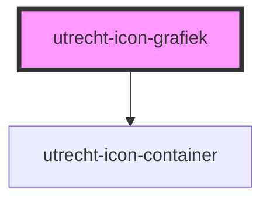

# utrecht-icon-grafiek

<!-- Auto Generated Below -->

## Properties

| Property      | Attribute       | Description | Type     | Default     |
| ------------- | --------------- | ----------- | -------- | ----------- |
| `iconTitle`   | `icon-title`    |             | `string` | `undefined` |
| `iconTitleId` | `icon-title-id` |             | `string` | `undefined` |

## Dependencies

### Depends on

- [utrecht-icon-container](../../utrecht-icon-container)

### Graph

----------------------------------------------

*Built with [StencilJS](https://stenciljs.com/)*
