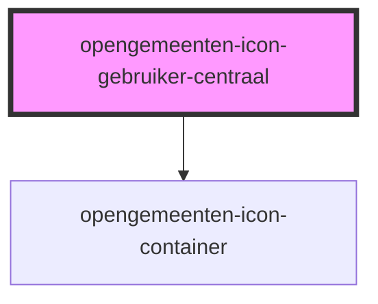

# opengemeenten-icon-gebruiker-centraal

<!-- Auto Generated Below -->

## Dependencies

### Depends on

- [opengemeenten-icon-container](../../opengemeenten-icon-container)

### Graph

----------------------------------------------

*Built with [StencilJS](https://stenciljs.com/)*
